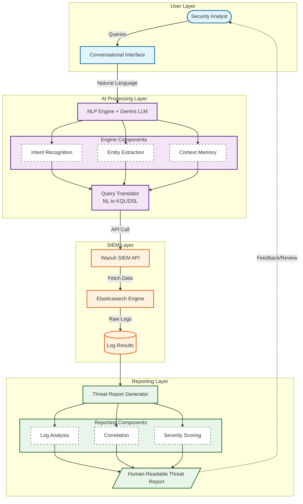

# Architecture Diagram: Conversational SIEM Assistant

## Mermaid Diagram Source

## Description
This diagram illustrates the flow of information from a security analyst's query through an AI-powered processing layer that translates intent into SIEM queries, fetches logs from Wazuh/Elasticsearch, and finally generates a correlated threat report.
